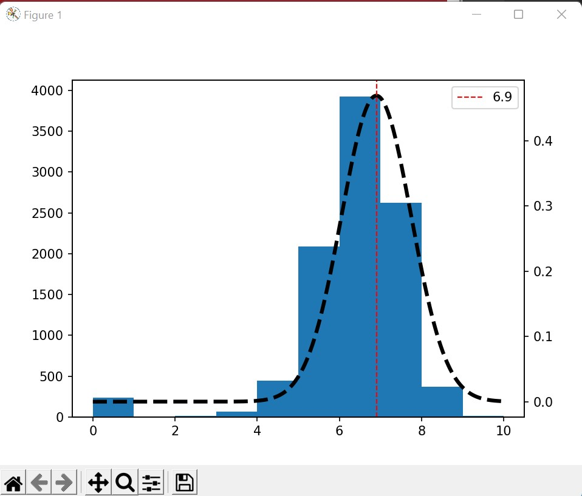

# Criticas-de-peliculas

Mi dirección de GitHub para este repositorio es el siguiente: [GitHub](https://github.com/andmansim/Criticas-de-peliculas.git)
https://github.com/andmansim/Criticas-de-peliculas.git

He realizado un programa para realizar un análisis estadístico de los números de votos de las valoraciones de película, que explico a continuación:

# Explicar críticas de películas
En este ejercicio vamos a realizar algo similar al ejercicio de unas notas en clase, es decir, realizaremos un análisis estadístico programando las clases necesarias y utilizando ciertas funciones que vienen en Python. El enunciado dice así: Tenemos unas películas que han sido clasificadas del 0 al 10 por 10000 personas. Calcularemos su análisis estadístico para saber más datos sobre este suceso.

# Inicio
Comenzaremos por importar las librerías que nos van a ser de gran utilidad, las cuales son:
	Pandas
	NumPy
	Matplotlib
Pandas es una librería de Python especializada en el manejo y análisis de estructuras de datos. Sus usos principales son: definir nuevas estructuras de datos basadas en arrays(listas) de la librería NumPy, (que hablaremos más adelante), permite leer y escribir ficheros en formato CSV, Excel y bases de datos SQL, permite acceder a datos mediante sus índices o nombres de filas y columnas. También podemos reordenar, dividir y combinar datos, trabajar con series temporales y, por último, realiza operaciones de manera eficiente. 
NumPy es una librería especializada en el cálculo numérico y en el análisis de datos, especialmente para un gran volumen de datos. Además, nos permite trabajar con arrays/listas, que sirve para representar datos de un mismo tipo en varias dimensiones, al igual que es muy fácil manipular dichos datos.
Matplotlib, es una librería especializada en la creación de gráficos en dos dimensiones y personalizarlos.
Tras esta explicación, en el main, importaremos la librería pandas y el fichero funciones, junto con todas sus funciones. Y pondremos if __name__ == '__main__':, donde irá todo el código principal. En esta explicación indicaré que parte se encuentra en el fichero main.py, mediante un #Main y lo que se encuentra en el fichero funciones.py, mediante #Funciones.
```
#Main
import pandas as pd
from funciones import*
```
En funciones.py importaremos:
```
#Funciones
import pandas as pd
import numpy as np
import matplotlib.pyplot as plt
```

# Crear DataFrame
Tenemos un DataSet con el ID, título, descripción, idioma, número de votos y valoración de las películas, pero a nosotros solo nos importa la valoración y el número de votos. Entonces, primero leeremos el fichero csv, mediante pandas, para cargarlo en un dataframe:
```
#Main
df = pd.read_csv('pelicula.csv', delimiter = ';', encoding='UTF-8')
```
Para leerlo usamos la función read_csv() y dentro indicamos el nombre del fichero CSV, su delimitador, es decir, su formato de separación y el formato para transformarlo a Python.
Si lo imprimimos obtenemos:
```
<<<
        Id                           title  ... Numero-de-votos Valoracion-pelicula
0        0                        Ad Astra  ...            2853                 5.9
1        1                       Bloodshot  ...            1349                 7.2
2        2               Bad Boys for Life  ...            2530                 7.1
3        3                         Ant-Man  ...           13611                 7.1
4        4  Percy Jackson: Sea of Monsters  ...            3542                 5.9
...    ...                             ...  ...             ...                 ...
9782  9995                           Cargo  ...             225                 5.9
9783  9996                  The Good Night  ...              67                 5.6
9784  9997              The World Is Yours  ...             234                 7.1
9785  9998             The Grand Seduction  ...             169                 6.7
9786  9999        Woochi: The Demon Slayer  ...              78                 6.7
>>>
```
Ahora vamos a crear un DataFrame con solo los datos que nos interesan, así que hacemos lo siguiente:
```
#Main
df = pd.DataFrame({'Valoracion-pelicula': df['Valoracion-pelicula'], 'Numero-de-votos': df['Numero-de-votos']})
```
Sustituiremos el valor de nuestra variable df por el nuevo DataFrame, donde le pasamos un diccionario con el nombre de las columnas que necesitamos y sus valores, que accedemos a ellos mediante df[‘nombre de la columna’].
Y obtenemos:
```
<<<
      Valoracion-pelicula  Numero-de-votos
0                     5.9             2853
1                     7.2             1349
2                     7.1             2530
3                     7.1            13611
4                     5.9             3542
...                   ...              ...
9782                  5.9              225
9783                  5.6               67
9784                  7.1              234
9785                  6.7              169
9786                  6.7               78
>>>
```
# Media aritmética
La media aritmética es el valor promedio de un conjunto de datos numéricos, en nuestro caso el número de votos, y se calcula sumando todos los conjuntos de valores y dividiéndolo entre el número total de valores.  
Pasos: 

1º Crearemos una función con los parámetros v_p (que contendrá los datos de la columna de valoración película), n_v(que contendrá los datos de la columna de número de votos). Aquí crearemos una variable donde multiplicamos cada valoración de las películas por el número de votos que ha tenido cada una de ellas. Sumamos todos los resultados y los dividimos entre la suma total de los datos, en este caso los 10000.

2º Nos retornará la variable m.

3º Redondeamos al segundo decimal, mediante la función round(), dentro le indicamos el valor a redondear y los decimales.
```
#Funciones
def calculomedia(v_p, n_v):
    m = ((v_p * n_v).sum())/(n_v.sum())
    return m

#Main
media = calculomedia(df['Valoracion-pelicula'], df['Numero-de-votos'])
media = round(media, 2)
print('La media es: ' + str(media))
```
# Mediana
La mediana es el valor que ocupa el lugar central de todos los datos cuando estos están ordenados de menor a mayor.

1º Hacemos una función que se va a encargar de ordenar las valoraciones de las películas, mediante la función .sort_values(by=columna), también nos mueve todas las columnas relacionadas con sus valores. A esta función le pasaremos el DataFrame mediante el parámetro df.

2º Tras ordenarla sumamos los números de votos de cada fila con el anterior, de tal forma que vamos poniendo el valor acumulado. Tras hacerlo con todos quien estaría en la última fila sería el número total de datos, es decir, los 10000. A todo esto, se le llama suma acumulativa, donde vamos sumando valores y al final obtenemos el conjunto entero. En vez de calcularlo a mano, usaremos .cumsum(), que nos creará una columna con dichos valores acumulados.

3º Como hemos explicado anteriormente, la mediana es el valor que ocupa la posición central, así que dividiremos el número total de datos entre 2 y recogemos su valor en q. 

4º Haremos un bucle for donde irá mirando si el valor de q es menor que alguno de los acumulados, si es así, el primer número mayor que q, corresponde a la mediana. Pero claro, nosotros sabemos el valor acumulado que corresponde a la mediana y la fila en la que se encuentra, pero no la valoración que le corresponde. Para eso está la variable e, que se encarga de contar cuántos datos son menores que q.

5º Esta función nos devolverá la valoración correspondiente en dicha fila. Accederemos a las filas mediante la función .iloc[número de fila, columna]

```
#mediana
#Funciones
def calculo_mediana(df):
    ordenado = df.sort_values(by='Valoracion-pelicula')
    suma = ordenado['Numero-de-votos'].cumsum()
    q = df['Numero-de-votos'].sum() / 2
    e = 1
    for i in suma:
        if q < i:
            return ordenado.iloc[e - 1, 0]
        else:
            e = e + 1
#Main
mediana = calculo_mediana(df)    
print('La mediana es:' + str(mediana))
```
# Moda
La moda, es el valor que más se repite de todos nuestros datos. Para calcularlo vamos a ver el máximo de número de votos y hallarnos su valoración correspondiente, seguiremos el mismo procedimiento que para el cálculo de la mediana. Esto lo realizaremos mediante la función calculomoda, que le pasaremos los datos de la columna número de votos.
```
#moda
#Funciones
def calculomoda(n_v):
    a = 1
    for i in n_v:
        if i == n_v.max():
            b = a
            return b
        else: 
            a = a + 1
#Main
b = calculomoda(df['Numero-de-votos'])
moda = df.iloc[b-1,0]
print('La moda es: ' + str(moda))
```
# Varianza y desviación típica
La varianza es una medida de dispersión que representa cuanto varían los datos respecto a la media. Se calcula de la siguiente manera: ∑(valores(valoración películas)- media)^2/n. A cada valor de la valoración se le resta la media y se le eleva al cuadrado. Después se suman todos ellos y los dividimos entre el número total de valores.
La desviación típica mide lo mismo que la varianza. Para calcularla solo hay que hacer la raíz de la varianza. 

Pasos: 

1º Es aplicar la fórmula y le debemos multiplicar a cada valoración el número de votos que tiene. Esto se realizará en la función varianza, tiene de parámetros, las columnas: número de votos, valoración películas y la media, y nos devolverá el valor calculado.

2º Redondeamos al segundo decimal
```
# varianza
#Funciones
def varianza(v_p, n_v,m):
    v = ((n_v * ((v_p - m)**2)).sum()/(n_v.sum()))
    return v

#Main
 varianza = varianza(df['Valoracion-pelicula'], df['Numero-de-votos'], media)
 varianza = round(varianza, 2)
 print('La varianza es: ' + str(varianza))
```
Con la desviación típica tan solo hacemos la raíz cuadrada de la varianza y lo redondeamos al segundo decimal.
```
#desviación típica
#Main
desviacion_tipica = varianza ** (1/2)
desviacion_tipica = round(desviacion_tipica, 2)
print('La desviación típica es: ' + str(desviacion_tipica))
```
# Máximos y mínimos
Para calcular el valor máximo y el mínimo, tan solo debemos usar las funciones .max() y .min(), respectivamente, de los datos de las valoraciones.
```
#máximo y mínimo
#Main
max = df['Valoracion-pelicula'].max()
print('El valor máximo es: ' + str(max))
min = df['Valoracion-pelicula'].min()
print('El valor mínimo es: ' + str(min))
```
# Cuartiles
Los cuartiles son valores que dividen un conjunto de datos en cuatro partes iguales. Tenemos el primer cuartil, indica que el 25% de los datos es menor o igual al valor. El segundo cuartil equivale a la mediana, indica el 50% de los datos es menor o igual al valor. Por último, el tercer cuartil, indica el 75% de los datos es menor o igual al valor.
Pasos:

1º Haremos una función general para que nos calcule el valor de los cuartiles. A esta función la llamaremos cuartiles y le pasaremos el parámetro suma, (recuerdo que es la variable que tiene los datos del DataFrame ordenados y la acumulación del número de votos), y el DataFrame(df).

2º Inicializamos las variables e1 y e3 con el 1, al igual que q1 y q3, (q1 = cuartil 1, q3 = cuartil 3, el cuartil 2 no se calcula dado que este es igual que la mediana), con las siguientes fórmulas: N/4, 3N/4, respectivamente. La N es el número total de votos, por tanto, los 10000, lo dividiremos por ¼ para saber el 25% y entre ¾ para saber el 75%. 

3º Contaremos cuántos valores son menores que q1, mediante e1 y lo mismo con q3 pero con e3.

4º Esta función nos devuelve una lista con los valores de e1 y e3

5º Q1: tan solo veremos el elemento que está en la fila e1 -1, dado que las filas en nuestro DataSet empiezan por cero, y columna 0, con la función .iloc[]

6º Haremos lo mismo que con Q1, pero con Q3 y en vez de usar e1 usaremos e3.
```
#Cuartiles
#Funciones
def cuartiles(suma, df):
    e1 = 1
    e3 = 1
    q1 = (df['Numero-de-votos'].sum() * 1)/4
    q3 = (df['Numero-de-votos'].sum() * 3)/4

    for i in suma:
        if q1 < i:
            pass
        else:
            e1 = e1 + 1
        
        if q3 < i:
            pass
        else:
            e3 = e3 + 1 
    return [e1, e3]

#Main
ordenado = df.sort_values(by='Valoracion-pelicula')
suma = ordenado['Numero-de-votos'].cumsum()
Q = cuartiles(suma, df)

#Q1
Q1 = ordenado.iloc[Q[0] - 1, 0]
print('El 25% de los votos tiene un valor inferior a ' + str(Q1))

#Q2
Q2 = mediana
print('El 50% de los votos tiene un valor inferior a ' + str(Q2))

#Q3
Q3 = ordenado.iloc[Q[1] - 1, 0]
print('El 75% de los votos tiene un valor inferior a ' + str(Q3))
```
# Gráfica
Usaremos la función representacion con los parámetros: df, desviación típica, máximo, mínimo, media y varianza, para pintar un histograma de los datos, junto con la campana de Gauss.
Pasos:

1º Establecemos los valores del eje x e y para la campana de Gauss, la cual estará comprendida entre el máximo y el mínimo. Para representar el eje x usaremos la np.arange(min, max, 0.01), donde tenemos la librería NumPy y usaremos la función arange(), con el máximo, mínimo y el intervalo de los valores. El eje y se representa mediante una fórmula característica de la campana de Gauss: 1/(desviación típica  raíz(2Π))  e^(-(valores del eje x  - media )^2 / (2 varianza)

2º Le indicamos que vamos a crear dos gráficas juntas y la dimensión de ellas.

3º Vamos a indicarle la primera gráfica a representar, el histograma, mediante ax1. Para ello usaremos la función .hist() y le indicaremos dentro los valores que irán en el eje x, al igual que los valores del eje y asociados a él. 

4º Usaremos la función .twinx() para indicarle que debe solapar el gráfico dos con el uno.

5º El segundo gráfico es la campana de Gauss, donde debemos de indicarle los valores del eje x, los del y, el color, estilo y ancho de la curva. Usaremos la función .plot(), para ello.

6º Este paso no sería estrictamente necesario. Ahora vamos a indicar la posición de la media, mediante .axline(), donde le pasaremos el valor de la media, color, estilo, ancho y nombre de dicha recta. Si queremos poner dicho valor en una posición específica usaremos .legend(loc=posición), la posición debe de ser el nombre del lugar donde queremos esa etiqueta.

7º Antes de acabar, debemos escribir la función .show(), para que nos muestre en una pantalla el gráfico.

```
#Funciones
#Histograma
def representacion(df, desviacion_tipica, max, min, media, varianza):
    x = np.arange(min, max, 0.01)
    f = 1/(desviacion_tipica * np.sqrt(2*np.pi)) * np.exp(-(x - media) ** 2/(2 * varianza))
    
    fig, ax1 = plt.subplots()
    plt.subplot(1,1,1)
    ax1.hist(df['Valoracion-pelicula'])
    ax2 = ax1.twinx()
    ax2.plot(x, f, color = 'black', linestyle = 'dashed', linewidth=3)
    plt.axvline(media, color='red', linestyle='dashed', linewidth=1,label = str(media))
    plt.legend(loc='upper right')
    plt.show()

#Main
#Representación 
    representacion(df, desviacion_tipica, max, min, media, varianza)
```
Cuando le damos a ejecutar todo el código, obtendremos los siguientes datos estadísticos:
```
<<<
La media es: 6.9
La mediana es:6.9
La moda es: 8.3
La varianza es: 0.72
La desviación típica es: 0.85
El valor máximo es: 10.0
El valor mínimo es: 0.0
El 25% de los votos tiene un valor inferior a 6.3
El 50% de los votos tiene un valor inferior a 6.9
El 75% de los votos tiene un valor inferior a 7.5
>>>
```

Y la siguiente gráfica:

